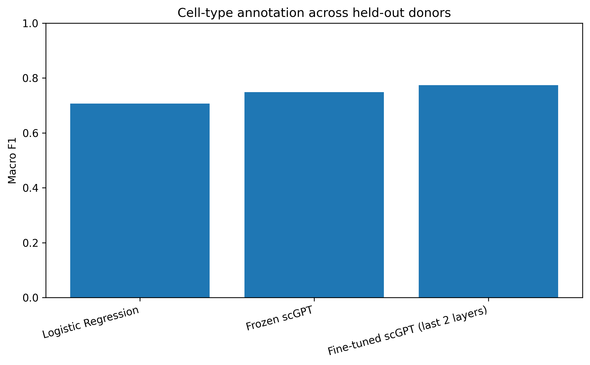
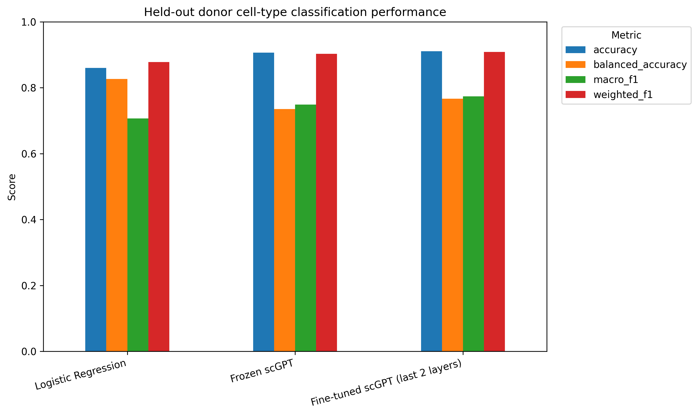
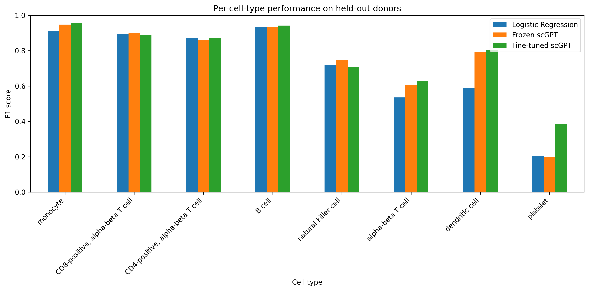
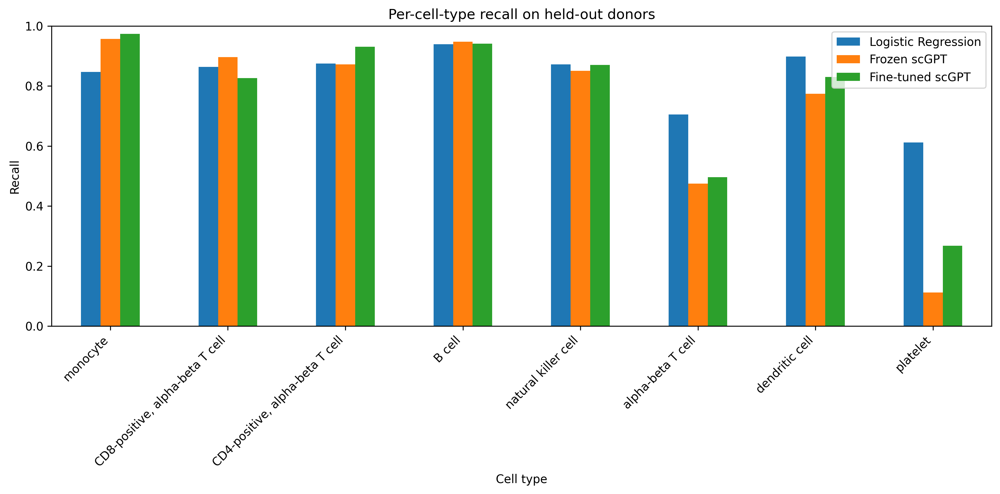
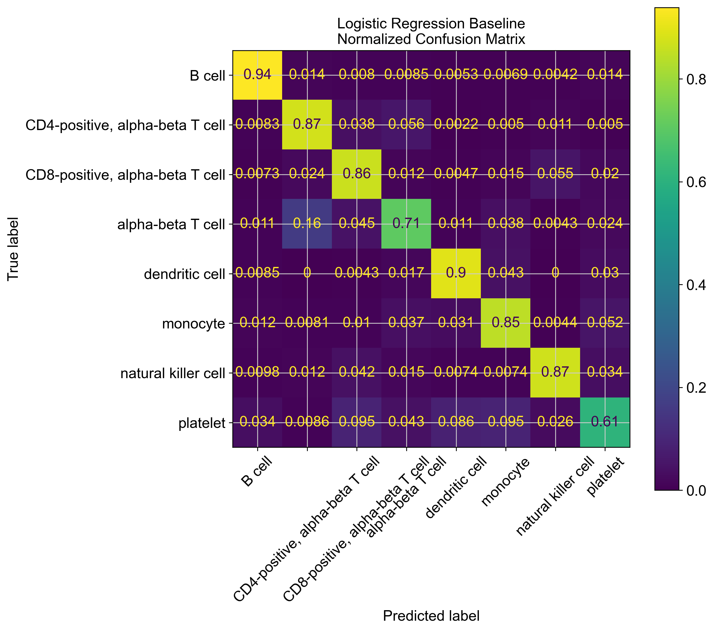
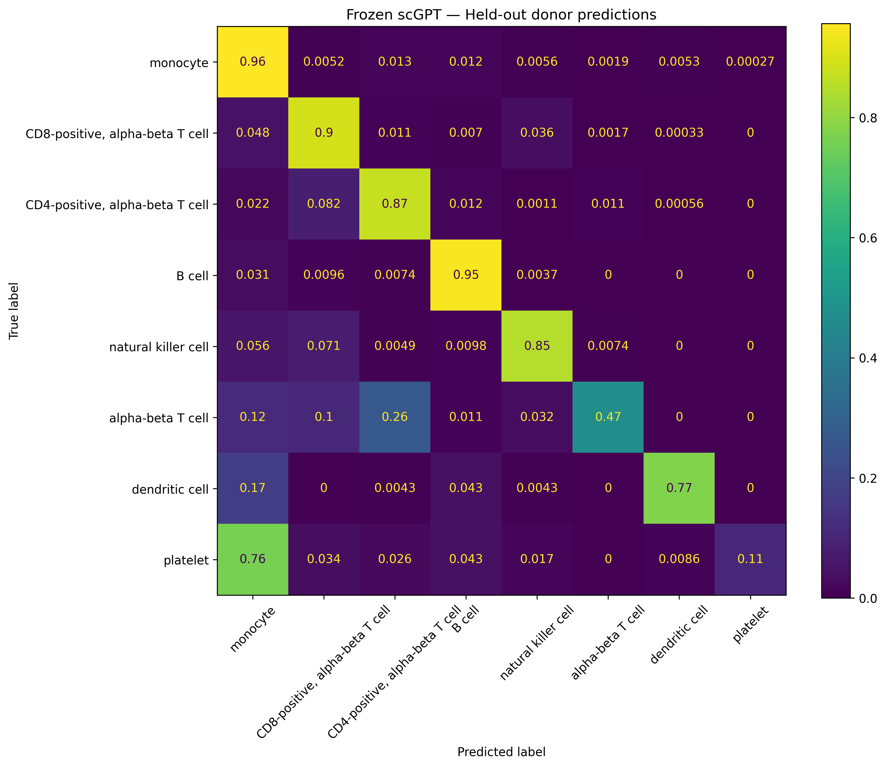
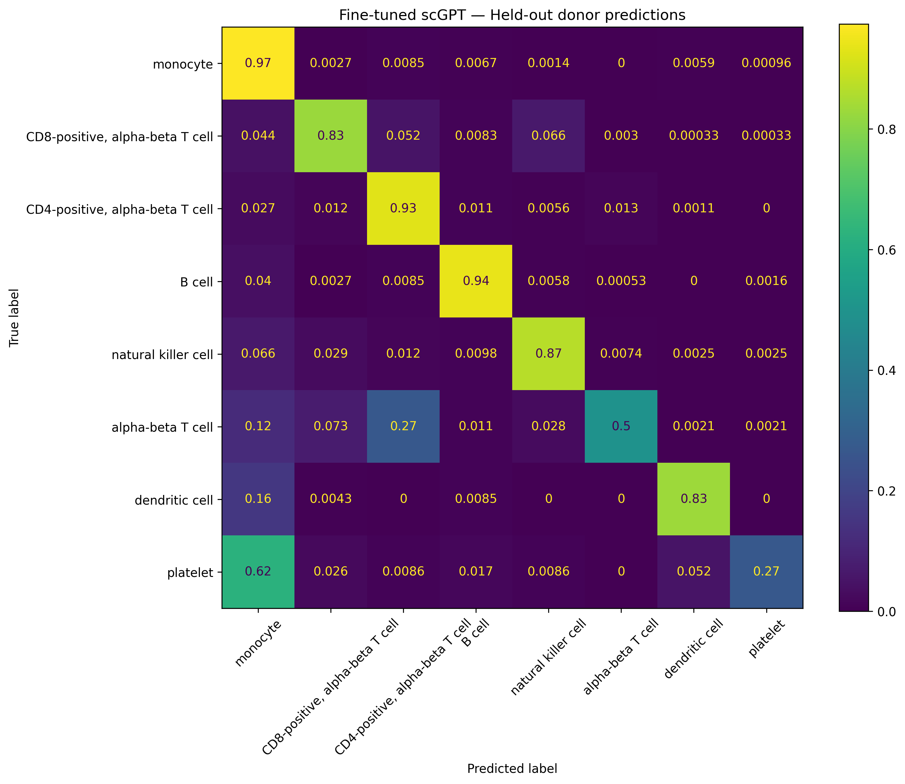

# Fine-Tuning scGPT for Cross-Donor Cell-Type Annotation

This project evaluates whether a pretrained single-cell foundation model can improve **cell-type annotation across unseen donors** compared with a conventional machine-learning baseline.

Using a donor-aware train/validation/test split, I compared three approaches:

1. **Logistic regression baseline** using training-selected highly variable genes (HVGs) and dimensionality reduction.
2. **Frozen scGPT** with the pretrained transformer backbone fixed and only a new classification head trained.
3. **Partially fine-tuned scGPT** with the classification head and final transformer layers adapted to the annotation task.

The main result is that pretrained scGPT representations improve held-out-donor classification over the classical baseline, and task-specific fine-tuning improves Macro F1 further.

---

## Key Results

| Model | Accuracy | Balanced Accuracy | Macro F1 | Weighted F1 |
|---|---:|---:|---:|---:|
| Logistic Regression | 0.8601 | **0.8264** | 0.7070 | 0.8780 |
| Frozen scGPT | 0.9067 | 0.7355 | 0.7486 | 0.9027 |
| **Fine-tuned scGPT** | **0.9105** | 0.7669 | **0.7738** | **0.9084** |

Relative to logistic regression, the fine-tuned model improved:

- **Accuracy by 5.04 percentage points**
- **Macro F1 by 0.0668**
- **Weighted F1 by 0.0304**

The frozen-backbone experiment provides an ablation of the value of pretraining:

- Logistic Regression → Frozen scGPT: **+0.0416 Macro F1**
- Frozen scGPT → Fine-tuned scGPT: **+0.0252 Macro F1**

This suggests that both the pretrained scGPT representation and task-specific transformer adaptation contributed to improved performance.



---

## Project Question

**Can a pretrained single-cell foundation model be adapted to classify immune-cell populations from donors that were never seen during training?**

A random cell-level split can leak donor-specific biological and technical signals between training and test sets. To make the evaluation more realistic, all cells from a donor were assigned to only one split.

The project therefore measures **cross-donor generalization**, rather than performance on randomly held-out cells from already-seen donors.

---

## Dataset

Single-cell RNA-seq data were obtained through the **CELLxGENE Census**.

- CELLxGENE dataset ID: `fa8605cf-f27e-44af-ac2a-476bee4410d3`
- Total modeled cells: **58,335**
- Cell types: **8**
- Highly variable genes selected from training data: **2,000**
- Random seed: **42**

### Donor-aware split

| Split | Donors | Cells |
|---|---:|---:|
| Training | 10 | 32,252 |
| Validation | 2 | 10,866 |
| Test | 3 | 15,217 |

The eight target classes were:

- monocyte
- CD8-positive, alpha-beta T cell
- CD4-positive, alpha-beta T cell
- B cell
- natural killer cell
- alpha-beta T cell
- dendritic cell
- platelet

HVG selection was performed using the **training split only** to avoid feature-selection leakage into validation or test data.

---

## Experimental Design

The same donor splits, target classes, HVG set, preprocessing strategy, and evaluation metrics were used across models.

```text
Single-cell RNA-seq data
        |
        v
Quality control
        |
        v
Donor-aware train / validation / test split
        |
        v
2,000 training-derived HVGs
        |
        +--------------------------+
        |                          |
        v                          v
Logistic Regression            scGPT preprocessing
baseline                       + tokenization
                                   |
                         +---------+---------+
                         |                   |
                         v                   v
                  Frozen scGPT        Fine-tuned scGPT
                  backbone            transformer
                         |                   |
                         +---------+---------+
                                   |
                                   v
                           Held-out donors
```

### Preprocessing

For the scGPT experiments:

- genes were matched to the pretrained scGPT vocabulary
- expression counts were normalized to a total of `1e4` counts per cell
- values were log-transformed
- expression values were discretized into **51 bins**
- sequences were padded/truncated to a maximum length of **1,024 tokens**
- zero-expression genes were excluded from token sequences

The same training-derived HVGs were used for both frozen and fine-tuned scGPT experiments.

---

## Models

### 1. Logistic Regression Baseline

The classical baseline used:

1. 2,000 training-selected HVGs
2. log-normalized expression values
3. truncated SVD to 50 components
4. feature standardization
5. class-balanced logistic regression

The class weights compensate for the strong imbalance between common populations such as monocytes and rare populations such as platelets.

### 2. Frozen scGPT

The pretrained scGPT model was loaded from the official whole-human checkpoint.

For the frozen experiment:

- the pretrained gene encoder was frozen
- all transformer layers were frozen
- only the task-specific cell-type classification head was trained

This experiment measures how informative the pretrained scGPT representation is **without updating the transformer backbone**.

### 3. Fine-Tuned scGPT

For partial fine-tuning:

- pretrained scGPT weights were loaded
- most of the pretrained network remained frozen
- the final transformer layers were made trainable
- the classification head was trained
- class-weighted cross-entropy was used as the objective

The model was selected using **validation Macro F1**, not test-set performance.

Training used:

- Adam optimizer
- initial learning rate: `1e-4`
- batch size: `8`
- learning-rate decay with `StepLR`
- gradient clipping
- validation-based checkpoint selection

---

## Overall Performance



The foundation-model approaches achieved substantially higher overall accuracy and weighted F1 than logistic regression.

However, logistic regression produced the highest **balanced accuracy**. This is an important result rather than a contradiction: balanced accuracy is the mean recall across classes, while Macro F1 accounts for both precision and recall.

The class-level results show that the models made different precision/recall tradeoffs, especially for rare populations.

---

## Per-Cell-Type Performance



Fine-tuned scGPT achieved strong performance on major immune populations while improving several difficult classes.

Selected F1 scores:

| Cell type | Logistic Regression | Frozen scGPT | Fine-tuned scGPT |
|---|---:|---:|---:|
| Monocyte | 0.910 | 0.948 | **0.957** |
| CD8 T cell | 0.894 | **0.900** | 0.889 |
| CD4 T cell | 0.872 | 0.862 | **0.872** |
| B cell | 0.933 | 0.934 | **0.942** |
| Natural killer cell | 0.717 | **0.746** | 0.706 |
| Alpha-beta T cell | 0.535 | 0.607 | **0.630** |
| Dendritic cell | 0.590 | 0.793 | **0.806** |
| Platelet | 0.205 | 0.198 | **0.388** |

Two of the largest gains from the foundation-model approaches occurred for **dendritic cells** and the broader **alpha-beta T-cell** category.

Fine-tuning also substantially improved platelet F1 relative to the frozen model.

---

## Why Balanced Accuracy Behaves Differently



The recall plot explains why logistic regression retained the highest balanced accuracy.

For example, platelet recall was:

- Logistic Regression: **0.612**
- Frozen scGPT: **0.112**
- Fine-tuned scGPT: **0.267**

Despite lower platelet recall, fine-tuned scGPT increased platelet F1 to **0.388**, compared with **0.205** for logistic regression. This reflects a different precision/recall tradeoff.

A similar pattern appears for dendritic cells:

| Model | Recall | F1 |
|---|---:|---:|
| Logistic Regression | **0.898** | 0.590 |
| Frozen scGPT | 0.774 | 0.793 |
| Fine-tuned scGPT | 0.830 | **0.806** |

The logistic model identifies a larger fraction of dendritic cells, but scGPT achieves a much stronger balance between precision and recall.

---

## Confusion Matrices

### Logistic Regression



The baseline captures most major immune populations well but produces more false positives for some minority classes.

### Frozen scGPT



The frozen backbone performs strongly on common cell populations, demonstrating that useful cell-state information is already present in the pretrained representation. Its largest weakness is platelet recall.

### Fine-Tuned scGPT



Fine-tuning improves adaptation to the target annotation problem, including better recovery of dendritic cells and platelets compared with the frozen representation.

---

## Fine-Tuning Behavior

The fine-tuned model was trained for five epochs. Training Macro F1 increased steadily from **0.791 to 0.816**, while validation Macro F1 increased from **0.638 to 0.655**.

| Epoch | Train Macro F1 | Validation Macro F1 | Validation Accuracy |
|---:|---:|---:|---:|
| 1 | 0.791 | 0.638 | 0.818 |
| 2 | 0.800 | 0.653 | 0.826 |
| 3 | 0.805 | 0.650 | 0.833 |
| 4 | 0.812 | 0.653 | 0.825 |
| 5 | **0.816** | **0.655** | 0.824 |

The validation curve suggests that most of the gain occurred early, with performance approaching a plateau rather than continuing to improve rapidly with additional epochs.

---

## Repository Structure

```text
.
├── notebooks/
│   ├── 01_Baseline.ipynb
│   ├── 02_scGPT_finetuning.ipynb
│   └── 03_Frozen_scGPT.ipynb
│
├── figures/
│   ├── baseline_confusion_matrix.png
│   ├── frozen_scgpt_confusion_matrix.png
│   ├── scgpt_confusion_matrix.png
│   ├── three_model_macro_f1.png
│   ├── three_model_all_metrics.png
│   ├── three_model_per_class_f1.png
│   └── three_model_per_class_recall.png
│
├── results/
│   ├── baseline_metrics.csv
│   ├── baseline_classification_report.csv
│   ├── frozen_scgpt_metrics.csv
│   ├── frozen_scgpt_classification_report.csv
│   ├── scgpt_metrics.csv
│   ├── scgpt_classification_report.csv
│   ├── scgpt_training_history.csv
│   ├── three_model_comparison.csv
│   └── three_model_per_class.csv
│
└── README.md
```

Large raw `.h5ad` datasets and pretrained model checkpoints are not intended to be stored directly in the repository.

---

## Environment

The project was developed with:

- Python 3.10
- PyTorch 2.3
- scGPT 0.2.4
- Scanpy
- CELLxGENE Census
- scikit-learn
- pandas
- NumPy
- SciPy
- Matplotlib

The pretrained scGPT checkpoint should be downloaded separately and placed in a structure similar to:

```text
models/
└── scGPT_human/
    ├── args.json
    ├── best_model.pt
    └── vocab.json
```

---

## Reproducing the Analysis

Run the notebooks in order:

```text
01_Baseline.ipynb
        |
        v
02_scGPT_finetuning.ipynb
        |
        v
03_Frozen_scGPT.ipynb
```

The first notebook performs data preparation, donor splitting, HVG selection, and baseline modeling. The later notebooks reuse the same experimental design for frozen and fine-tuned scGPT comparisons.

For the fairest comparison, all three approaches should use:

- identical donor splits
- identical target cell types
- the same training-derived HVGs
- the same held-out test donors
- the same reported evaluation metrics

---

## Main Takeaways

- **Donor-aware evaluation matters.** Entire donors were held out instead of randomly splitting cells, making the test set a more realistic measure of biological generalization.
- **Pretraining contributed measurable value.** Frozen scGPT improved Macro F1 from **0.707 to 0.749** over logistic regression.
- **Fine-tuning provided an additional gain.** Macro F1 increased further to **0.774**.
- **The best model depends on the metric.** Fine-tuned scGPT achieved the strongest accuracy, Macro F1, and weighted F1, while logistic regression retained the highest balanced accuracy.
- **Performance gains were not uniform across cell types.** Fine-tuning especially improved dendritic-cell and platelet F1, while frozen scGPT performed slightly better on some classes such as CD8 T cells and natural killer cells.

---

## References

- [scGPT: a foundation model for single-cell multi-omics](https://github.com/bowang-lab/scGPT)
- [CZ CELLxGENE Discover](https://cellxgene.cziscience.com/)
- [Scanpy](https://scanpy.readthedocs.io/)
- [scikit-learn](https://scikit-learn.org/)

---

## Author

Built as a computational biology / machine-learning project exploring **foundation-model transfer learning for single-cell RNA-seq analysis**.
